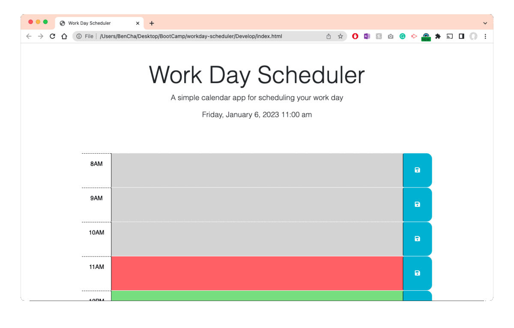

# Workday Scheduler

Workday Scheduler is a basic application for scheduling and tracking events for the workday.

## Usage

- The current time is displayed above the schedule. It is auto-updated.
- The schedule is divided into hourly time blocks.
- Click in the time block to type an event. Click on the save button to the right to save the event in your browser.
- To delete an event, simply delete the text and save.
- The current time block is shown red. Past time blocks are gray, and upcoming time blocks are green.

## Demo

## Support

If you have any issues or questions, contact [Ben](mailto:mrbenjamincha@gmail.com).\
[Workday Scheduler](https://bencha27.github.io/workday-scheduler/)\
[GitHub](https://github.com/bencha27/workday-scheduler)
